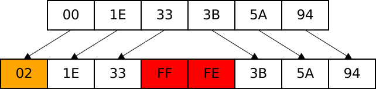
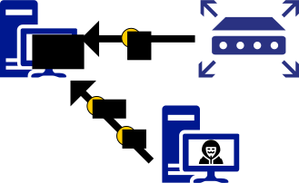
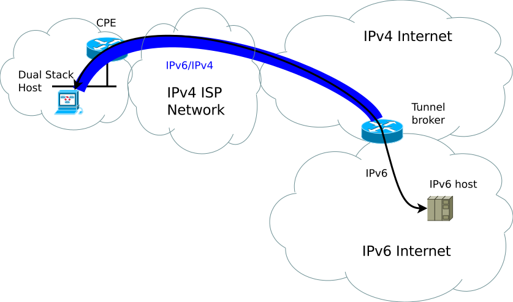
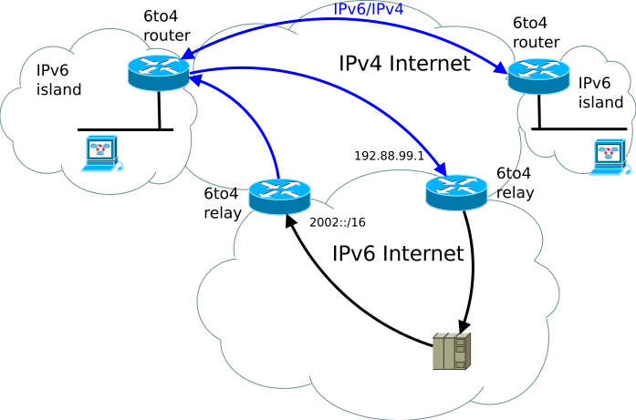
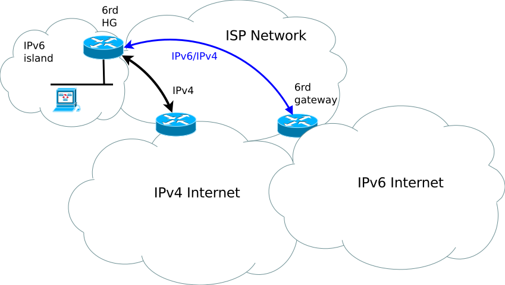

% Internet Protocol version 6
% Élie ROUDNINSKI
% 19/11/2017

# Pourquoi IPv6

## **Au début des années 90**

Épuisement des adresses IPv4 [RFC1380] :

- 2<sup>32</sup> = 4 294 967 296 d'adresses IPv4
- Plus 7 milliards d'êtres humains actuellement ...
- Dernier bloc /8 distribué par l'*IANA* le 3 février 2011

Nouveaux besoins et nouvelles technologies :

- Table de routage trop volumineuse
- Multiplication des points d'accès
- Démocratisation des smartphones, des objets connectés, etc.
- Besoin en qualité de service : VoIP, IPTV, etc.

➡ **tout est transporté sur IP**

## **Différentes solutions ...**

Notation CIDR pour le routage :

- Classless Inter-Domain Routing [RFC1518, RFC1519, RFC4632]
- Remplacement des classes par des masques de tailles variable
- Ex : 192.0.2.0/23

NAT pour la distribution d'IPv4 :

- Allocation de plages d'adresses privées [RFC4632, RFC1918]
    - 10.0.0.0/8
    - 172.16.0.0/12
    - 192.168.0.0/16
- Traduction entre adresses privées et adresses publiques

## **... mais aucunes satisfaisantes**

Besoin d'un nouveau protocole :

- Appel à projet en 1993
- 20 livres blancs proposés
- SIPP/IPng sélectionné qui deviendra IPv6
- Spécifications publiées en 1998 [RFC2460]
- L'IANA distribues les premiers blocs en 1999

Spécifications d'IPv6 :

- Adresses plus grandes
- "Simplification" de l'en-tête
- Authentification et chiffrement (IPsec)
- Protection de la vie privée
- Spécification native du *multicast*, de l'auto-configuration etc.

# Le protocole IPv6

## **L'en-tête IPv6**

Pour rappel :


- Au moins 20 octets
- Au moins 13 champs

## **L'en-tête IPv6**


- Exactement 40 octets
- Exactement 8 champs

## **Évolutions** ... de l'en-tête

- Fragmentation "facultative"

    ⇒ suppression des champs `Id`, `Flags` et `Fragment Offset`

- Intégrité laissé aux couches supérieurs

    ⇒ suppression du champ `Header Checksum`

- Les options sont supprimées, la taile est fixe

    ⇒ suppression du champ `IHL`

## **Évolutions** ... des adresses

- Taille de 128 bits contre 32 bits en IPv4 
    - 667 millions de milliards par mm2
- 8 groupes de 2 octets en notation hexadécimal
<div lang="en-US">
    - **`fe80:0:0:0:210:18ff:fe95:3168`**
</div>
- On regroupe la plus longue suite de double octets nuls
<div lang="en-US">
    - **`fe80::210:18ff:fe95:3168`**
</div>
- On utilise la notation CIDR pour l'adresse du réseau 
<div lang="en-US">
    - **`fe80::210:18ff:fe95:3168/64`**
</div>

## **Évolutions** ... du transport

- *MTU* minimum de 1280 octets (pas respecté en pratique)
- *Path MTU discovery* obligatoire
- Plus de fragmentation par les routeurs

## **Évolutions** ... de l'adressage

Certains préfixes sont réservés pour des utilisations précises :

<div lang="en-US">

----------------  --------------------------------------------
`2000::/3`        Préfixe *unicast* globales (internet)
`2001:db8::/32`   Préfixe de documentation
`fc00::/7`        Adresses locales uniques (adresses privées)
`fe80::/10`       Adresses locales de lien
`ff00::/8`        Préfixe *multicast*
----------------  --------------------------------------------

</div>

Ainsi que certaines adresses :

<div lang="en-US">

+-------------+------------------------------------+
| `::`        | Adresse indéterminé                |
+-------------+------------------------------------+
|`::1`        | Adresse de l'interface loopback    |
+-------------+------------------------------------+

</div>

## **Évolutions** ... de l'adressage

Rappel sur les types de routage :

---------  --------------------------------------
Unicast    8.8.8.8 (serveur DNS Google)
Anycast    192.88.99.1 (passerelle 6to4)
Multicast  232.0.1.2 (France3 SD chez OrangeTV)
Broadcast  192.168.1.255
---------  --------------------------------------

{width=25%}\ 
{width=25%}\ 
{width=25%}\ 
{width=25%}\ 

## **Évolutions** ... de l'adressage

Remplacement du *broadcast* par différentes adresses *multicast* :

<div lang="en-US">

+-------------+------------------------------------+
|`ff02::/16`  | Préfixe *multicast* du réseau local|
+-------------+------------------------------------+
|`ff02::1`    | Tous les noeuds locaux             |
+-------------+------------------------------------+
|`ff02::2`    | Tous les routeurs locaux           |
+-------------+------------------------------------+

</div>

## **Configuration linux**

Un outil dédié aux réseaux IP :

- ip remplace ifconfig
- paquet iproute2 sous debian
- ip -6 pour passer en mode IPv6

### Lister les interfaces :

\tiny

<div lang="en-US">
~~~bash
adema@atlantis:~$ ip link show
1: lo:  mtu 65536 qdisc noqueue state UNKNOWN mode DEFAULT group default 
    link/loopback 00:00:00:00:00:00 brd 00:00:00:00:00:00
2: eth0:  mtu 1500 qdisc pfifo_fast state DOWN mode DEFAULT group default qlen 1000
    link/ether 18:67:b0:2f:76:d9 brd ff:ff:ff:ff:ff:ff
~~~
</div>

## **Configuration linux**

### Lister les adresses :

\tiny

<div lang="en-US">
~~~bash
adema@atlantis:~$ ip -6 addr show
1: lo:  mtu 65536 
    inet6 ::1/128 scope host 
       valid_lft forever preferred_lft forever
3: wlan0:  mtu 1500 qlen 1000
    inet6 fe80::caf7:33ff:fefa:2cf6/64 scope link 
       valid_lft forever preferred_lft forever
~~~
</div>

### Ajouter une adresse :

\tiny

<div lang="en-US">
~~~bash
root@atlantis:~# ip -6 addr add 2001:db8::1/64 dev eth0
root@atlantis:~# ip -6 addr show dev eth0
2: eth0:  mtu 1500 qlen 1000
    inet6 2001:db8::1/64 scope global tentative 
       valid_lft forever preferred_lft forever
~~~
</div>

## **Configuration linux**

### Lister les routes

\tiny

<div lang="en-US">
~~~bash
adema@atlantis:~$ ip -6 route show
2001:db8::/64 dev eth0  proto kernel  metric 256 
fe80::/64 dev tap0  proto kernel  metric 256 
fe80::/64 dev wlan0  proto kernel  metric 256
~~~
</div>

### Ajouter une route

\tiny

<div lang="en-US">
~~~bash
root@atlantis:~# ip -6 route add default via 2001:db8::2 dev eth0
root@atlantis:~# ip -6 route show dev eth0
2001:db8::/64  proto kernel  metric 256 
default via 2001:db8::2  metric 1024
~~~
</div>

### Supprimer une route

\tiny

<div lang="en-US">
~~~bash
root@atlantis:~# ip -6 route del default via 2001:db8::2 dev eth0
root@atlantis:~# ip -6 route show dev eth0
2001:db8::/64  proto kernel  metric 256 
~~~
</div>

## **Configuration linux**

### Afficher les statistiques

\tiny

<div lang="en-US">
~~~bash
adema@atlantis:~$ ip -s link
1: lo: <LOOPBACK,UP,LOWER_UP> mtu 65536 qdisc noqueue state UNKNOWN mode DEFAULT group default qlen 1000
    link/loopback 00:00:00:00:00:00 brd 00:00:00:00:00:00
    RX: bytes  packets  errors  dropped overrun mcast   
    1523412    30370    0       0       0       0       
    TX: bytes  packets  errors  dropped carrier collsns 
    1523412    30370    0       0       0       0       
2: wlan0: <BROADCAST,MULTICAST,UP,LOWER_UP> mtu 1500 qdisc mq state UP mode DORMANT group default qlen 1000
    link/ether c8:f7:33:fa:2c:f6 brd ff:ff:ff:ff:ff:ff
    RX: bytes  packets  errors  dropped overrun mcast   
    532466020  636787   0       2       0       0       
    TX: bytes  packets  errors  dropped carrier collsns 
    59879824   373643   0       0       0       0       
~~~
</div>

## **En-tête d'extension**

- Remplacement des options IPv4
- Couche pseudo-protocolaire entre IPv6 et la couche de transport
- Bénéficie d'un numéro de protocole IANA (comme TCP, etc.)
- Encodage ***T**ype-**L**ength-**V**alue* pour une gestion efficace par les équipements

\scriptsize

Table: Listes des en-têtes d'extension

---   ----------------
0     Hop-By-Hop Options Header
43    Routing Header
44    Fragmentation Header
50    Encapsulating Security Payload (IPSec ESP)
51    Authentication Header (IPSec AH)
60    Destination Options Header
135   Mobility Header
---   --------------------------------------------

## **En-tête d'extension**


## **En-tête d'extension**


## **En-tête d'extension** : *Hop-by-Hop Options*

En-tête d'extension, sensé apparaître en premier, qui specifie des options traitées par tous les noeuds sur le chemin du paquet :
- *Padding Options* : ajout de données de bourrage
- *Router Alert Option* : les données doivent être inspecté par les routeurs
- *Jumbogram Option* : le paquet est une trame géante

## **En-tête d'extension** : *Routing*


- Indique un certain nombre de nœuds intermédiaires à visiter
- *Routing Type* : 0 (déprécié), 1 (jamais utilisé), 2 (MIPv6)
- *Segments Left* : nombre de nœuds restant
- L'adresse de destination change pendant le trajet

## **En-tête d'extension** : *Fragmentation*


- Permet de fragmenter un paquet en plusieurs
- *Fragment Offset* (13 bits, en unité de 8 octets) : offset des données dans le paquet initial
- ***M**ore Flag* : reste-t-il des fragments ?
- *Identification* : identifie un ensemble de fragments

## **En-tête d'extension** : *Fragmentation*


## **En-tête d'extension** : *Fragmentation*


## **En-tête d'extension** : *IPSec*


Permet de signer un paquet (authentification et intégrité) :

- *SPI* : identifiant de la clé
- *SN* : numéro du paquet, incrémenté à chaque nouveau paquet
- *ICV* : HMAC du paquet

# Les protocoles ICMPv6

## **ICMPv6**

La pierre angulaire d'IPv6 :

- Indispensable à son fonctionnement
- Gestion des erreurs et des diagnostiques réseaux
- Gestion de l'autoconfiguration
- Regroupement d'ICMPv4, ARP, IGMP, IRDP, DHCP


Sous-protocole ICMPv6                                 Équivalent IPv4
----------------------------------------------------  ---------------
***N**eighbor **D**iscovery **P**rotocol*, **NDP**    ARP + IRDP + DHCP
***M**ulticast **L**istener **D**iscovery*, **MLD**   IGMP
***M**ulticast **R**outer **D**iscovery*, **MRD**

## **ICMPv6**


Type     Description
-------  -------------
0-127    Messages d'erreur
128-255  Messages d'information

## **ICMPv6** : Messages d'erreur

- renvoyé à l’émetteur lorsqu'un problème survient
- contenu rempli avec le paquet d'origine
- seulement 4 types défini par l'IANA

Type     Description
-------  -------------
1        Destination Unreachable
2        Packet Too Big
3        Time Exceeded
4        Parameter Problem

## **ICMPv6** : *Packet Too Big*

Lorsqu'un paquet est trop gros pour être acheminé, un routeur renvoi un message d'erreur *ICMP* "*Packet Too Big*" (Type 2)


## ***Neighbour Discovery Protocol***

Type     Message                   Description
-----    -------------             --------------
133      Router Solicitation       Demande une annonce de routeur
134      Router Advertisement      Annonce d'un routeur
135      Neighbour Solicitation     Demande une annonce d'adresse
136      Neighbour Advertisement    Annonce d'une adresse
137      Redirect                  Annonce d'une meilleur route


- Résolution d'adresse MAC
- Auto-configuration
- Détection des routeurs
- Détection des préfixes

## ***Neighbour Discovery Protocol***

Les messages *Neighbour Solicitation / Advertisement* remplissent le rôle d'ARP :

- *Neighbour Solicitation* : ARP who-has
- *Neighbour Advertisement* : ARP is-at

## ***Neighbour Discovery Protocol***

### Lister le cache des voisins

\tiny

```
adema@atlantis:~$ ip -6 neigh show
fe80::28c2:4f74:84e:9345 dev wlan0 lladdr 00:26:2d:9f:78:94 STALE
fe80::dd3d:b0a6:d5d3:427e dev wlan0 lladdr 4c:ed:de:1d:54:0a STALE
fe80::c10d:33fc:ec9d:1579 dev wlan0 lladdr 1c:4b:d6:7b:53:97 STALE
fe80::a9a2:1a91:d100:50b8 dev wlan0 lladdr 48:5b:39:07:b9:16 STALE
fe80::5cce:43af:8a45:9fc0 dev wlan0 lladdr 70:f1:a1:13:a6:83 STALE
```

### Vider le cache des voisins

\tiny

```
root@atlantis:~# ip -6 neigh flush dev wlan0
root@atlantis:~# ip -6 neigh show
fe80::28c2:4f74:84e:9345 FAILED
fe80::dd3d:b0a6:d5d3:427e FAILED
fe80::c10d:33fc:ec9d:1579 FAILED
fe80::a9a2:1a91:d100:50b8 FAILED
fe80::5cce:43af:8a45:9fc0 FAILED
```

## ***Neighbour Discovery Protocol***

Les messages *Router Solicitation / Advertisement* remplissent le rôle d'IRDP :

- *Router Solicitation* : qui sont les routeurs présents
- *Router Advertisement* : un routeur est présent

# Adressage

## Statique

Semblable à IPv4.

### Configuration Debian : /etc/network/interfaces

\tiny

<div lang="en-US">
```
iface eth0 inet6 static
    address 2001:db8::c0ca:1eaf
    netmask 64
    gateway 2001:db8::1ead:ed:beef
```
</div>

## Statique

### Lister les routes

\tiny

<div lang="en-US">
```
$ ip -6 route show
2001:db8::/64 dev eth0 proto kernel metric 256
fe80::/64 dev tap0 proto kernel metric 256
fe80::/64 dev wlan0 proto kernel metric 256
```
</div>

### Ajouter une route

\tiny

<div lang="en-US">
`$ ip -6 route add default via 2001:db8::2 dev eth0`
</div>

### Supprimer une route

\tiny

<div lang="en-US">
`$ ip -6 route del default via 2001:db8::2 dev eth0`
</div>

## Auto-configuration : ***S**tate**l**ess **A**ddress **A**uto**c**onfiguration* (***SLAAC***)

Fonctionnalité d'IPv6 qui consiste à s'attribuer une adresse :
<div lang="en-US">
1. Sélection d'un préfixe `/64`
    - Pré-établie comme `fe80::/64`
    - Par réception d'un message *ICMPv6 Router Advertisement*
2. Génération d'un suffixe de 8 octets par l'hôte
    - Format EUI-64 (*Link-local address*)
    - Données aléatoires (*Temporary Address*)
    - Données chiffrées (***C**ryptographically **G**enerated **A**ddress*)
    - Données hashées (*Stable Address*)
3. Concaténation des deux pour former une adresse
4. Détection de collision (***D**uplicate **A**ddress **D**etection*, ***DAD***)
</div>

## Auto-configuration : ***D**uplicate **A**ddress **D**etection* (***DAD***)
<div lang="en-US">
- envoie d'un message *ICMPv6 Neighbour Solicitation* :

-----------   ---------------------------
source        l'adresse indéterminé `::`
destination   l'adresse cible
-----------   ---------------------------

- Personne ne répond, l'adresse est libre, on peut l'utiliser
- Sinon ... on tente "autre chose"
</div>

## Auto-configuration : Adresses ***EUI-64***

Calcul d'un identifiant unique à partir d'une adresse MAC

{height=15%}

Utilisé pour :

- calculer l'adresse de lien-local à l'activation d'une interface
- calculer une adresse à partir d'un préfixe annoncé par un *RA*

## Auto-configuration : Adresses ***EUI-64***

Mais problème pour la vie privée :

- Algorithme EUI-64 réversible : MAC calculable à partir d'une adresse
- Pas de NAT, on peut donc :
    - Pister le matériel ou l'utilisateur sur le réseau
    - Deviner les failles impactant le matériel ou le logiciel

## Auto-configuration : Adresses temporaires

- RFC4941 : Privacy Extensions for SLAAC in IPv6 en 2007
- Génération d'un identifiant de 64bits aléatoire
- Identifiant valide pour une certaine durée
- Problème : l'adresse change régulièrement
    - Utilisé seulement pour les connexions sortantes
    - Difficile à administrer et surveiller pour un administrateur
    - Impossible de mettre en place des contrôles d'accès

### Configuration Linux

`$ echo 2 > /proc/sys/net/ipv6/conf/all/use_tempaddr`

## Auto-configuration : Adresses stables

- RFC7217 : `A Method for Generating Semantically Opaque Interface Identifiers with IPv6 SLAAC` en 2014 (pas encore accepté)
- `RID = F(Prefix, Net_Iface, Network_ID, DAD_Counter, secret_key)`
    - `RID` : identifiant aléatoire stable
    - `F` : fonction de hachage, SHA-256 par exemple
    - `Prefix` : préfixe annoncé lors d'un RA ou `fe80::/10`
    - `Net_Iface` : interface
    - `Network_ID` : identifiant du réseau, SSID par exemple, optionnel
    - `DAD_Counter` : nombre de tentative de DAD
    - `secret_key` : clé secrète générée sur chaque client
- Disponible sur Microsoft Windows, Linux et MacOS

## Auto-configuration : Adresses stables

- Compromis entre *Temporary Addresses* et ***C**ryptographically **G**enerated **A**ddress*
- Adresses fixes par préfixe/interface/réseau

### Configuration Linux

\tiny

<div lang="en-US">
`$ echo '0123:4567:89ab:cdef:0123:4567:89ab:cdef' > /proc/sys/net/ipv6/conf/default/stable_secret`
</div>

## Auto-configuration : Linux vs Systemd

Linux et Systemd sont partiellement incompatibles au niveau de l'auto-configuration :

- Linux implémente l'auto-configuration en espace noyau
    - est configuré par les sysctls
- Systemd implémente l'auto-configuration en espace utilisateur
    - peut ignorer ou être en conflit avec les sysctls
- Attention aussi à NetworkManager

## DHCPv6

Protocole semblable à DHCPv4 :

- Fonctionne sur UDP :
    - port 546 pour les clients
    - port 547 pour les serveurs
- Remplace/complète SLAAC
- Permet de gérer des tailles de préfixes supérieur à 64

### Configuration Debian : /etc/network/interfaces

\tiny

<div lang="en-US">
`iface eth0 inet6 dhcp`
</div>

## DHCPv6

Fonctionnement :

1. Envoie d'un paquet `DHCPv6 Solicit` depuis l'adresse de lien local du client
2. Réponse du serveur avec un paquet `DHCPv6 Advertise`
3. Réponse du client avec un paquet `DHCPv6 Request`
4. Réponse du serveur avec un paquet `DHCPv6 Reply`

Mais pas supporté par tout le monde (Android, ...).

## DNS

- Pas de DNSv6
- Juste un nouveau type pour les adresses IPv6 : ***AAAA***

### Exemple

\tiny

<div lang="en-US">
```
adema@atlantis:~$ dig ANY www.google.com
...
;; QUESTION SECTION:
;www.google.com.
IN ANY
;; ANSWER SECTION:
www.google.com. 49 IN A 216.58.204.4
www.google.com. 68 IN AAAA 2a00:1450:4009:801::2004
...
```
</div>

# Attaques locales

## Attaques classiques

- Pas de sécurité supplémentaire en local par rapport à IPv4

- Amplification du trafic local

    ⇒ ICMPv6 NS spoofing avec adresse multicast

- Homme du milieu

    ⇒ ICMPv6 NS spoofing avec adresse cible

- Déni de service

    ⇒ ICMPv6 NS spoofing en réponse à toutes les ***DAD***

## Attaque par réduction du MTU

{height=25%}

1. Simulation d'un ping de H2 vers H1 par l'attaquant
2. Réponse au ping de H1 vers H2 (on connaît sa réponse)
3. Envoie d'un message ICMPv6 Packet Too Big vers H1 par l'attaquant

## Attaque par imitation de routeur 1/2

{height=25%}

1. Annonce du vrai routeur

    ⇒ ICMPv6 RA avec durée de vie "normale"

2. Invalidation du vrai routeur
    
    ⇒ ICMPv6 RA avec durée de vie de 0

3. Annonce du faux routeur

## Attaque par imitation de routeur 2/2

{height=25%}

1. Simulation d'un ping de H2 vers H1 par l'attaquant
2. Réponse au ping de H1 vers H2 (on connaît sa réponse)
3. Envoie d'un message ICMPv6 Redirect vers H1 par l'attaquant

# Mécanismes de transition

## Transition d'IPv4 vers IPv6

Pourquoi ?

- IPv4 incompatible avec IPv6

Intérêt ?

 - Fournir une connectivité IPv6 à un hôte IPv4

Différentes méthodes :

- Double pile (`dual stack`)
- Traducteurs de protocoles :
    - Tunnels : 6in4, 6to4, 6rd, 6over4, Teredo, ISATAP
    - NAT64
    - DNS64

## Tunnel 6in4

- Plus simple des tunnels
- Encapsule un paquet IPv6 dans un paquet IPv4
- Connecte 2 réseaux IPv6 au travers d'un réseau IPv4
- Extrémités IPv4 statiques

{height=40%}

## Tunnel 6in4

\small

### Création du tunnel

<div lang="en-US">
`$ ip tunnel add TUN_NAME mode sit local LOCAL_ADDR4 remote REMOTE_ADDR4`
</div>

### Assignation de l'adresse

<div lang="en-US">
`$ ip -6 addr add 2001:db8::1/32 dev TUN_NAME`
</div>

### Routage du trafic

<div lang="en-US">
`$ ip -6 route add default via 2001:db8::1 dev TUN_NAME`
</div>

### Activation de l'interface

<div lang="en-US">
`$ ip link set dev TUN_NAME up`
</div>

## Tunnel 6to4 (obselète)

<div lang="en-US">

- Amélioration de 6in4
- Assigne un bloc IPv6 /48 à partir d'une adresse IPv4 publique
    - Concaténation de `2002::/48` avec l'adresse publique
- Adresse anycast 192.88.99.1 pour le routeur

</div>

{height=40%}

## Tunnel 6rd

- Amélioration de 6to4
- Utilisation d'un prefix spécifique au FAI à la place de `2002::/48`

{height=40%}

## Tunnel 6rd

\small

<div lang="en-US">

### Création du tunnel

<div lang="en-US">
`$ ip tunnel add 6rd mode sit local LOCAL_ADDR4`
</div>

### Assignation du préfixe

<div lang="en-US">
`$ ip tunnel 6rd dev 6rd 6rd-prefix 2001:db8::/32`
</div>

### Assignation de l'adresse

<div lang="en-US">
`$ ip addr add 2001:db8:c000:0264::1/32 dev 6rd`
</div>

### Routage du trafic

<div lang="en-US">
`$ ip route add ::/0 via ::1.2.3.4 dev 6rd`
</div>

### Activation de l'interface

<div lang="en-US">
`$ ip link set 6rd up`
</div>

## Tunnel Teredo

- Encapsule un paquet IPv6 dans un paquet UDP/IPv4
- Permet d'accéder à IPv6 même derrière un équipement qui fait du NAT
- Utilise le préfixe `2001::/32`
- Activé par défaut sous Microsoft Windows
- Disponible sous Linux : Miredo

# Conclusion

## Simplicité

- Évolutivité/modularité n'est pas simplicité
- Beaucoup de libertés dans le protocole
- En-têtes d'extension pas assez spécifié
- Possibilité de construire des paquets très complexes

## Sécurité

- Même problème qu'avec IPv4 (voir plus ...)
- Compléxité du protocole ⇒ maturité plus longue
- IPv4 a 32 ans et IPv6 a 15ans
- Encore beaucoup de bogues d'implémentation

## Outils

- **Scapy** : https://github.com/secdev/scapy/

    Framework de manipulation de paquets en python

- **THC-IPV6** : https://github.com/vanhauser-thc/thc-ipv6/

    Framework d'attaques sur IPv6 et ICMPv6

- **IPv6-Toolkit** : https://www.si6networks.com/tools/ipv6toolkit/

    Ensemble d'outils de diagnostique réseau IPv6
